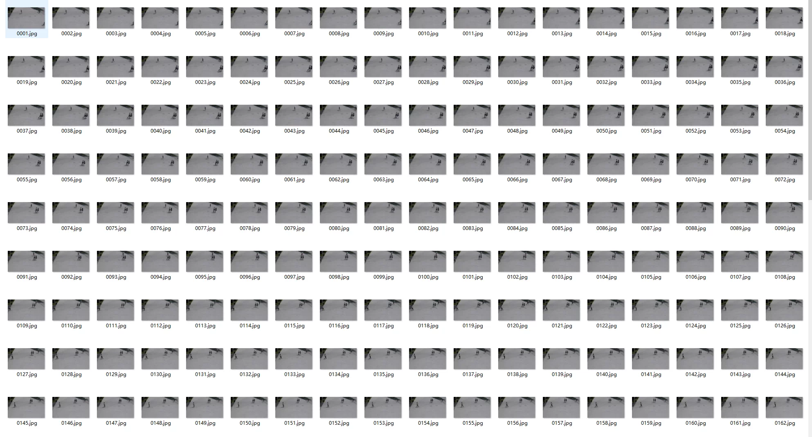
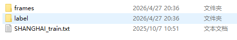
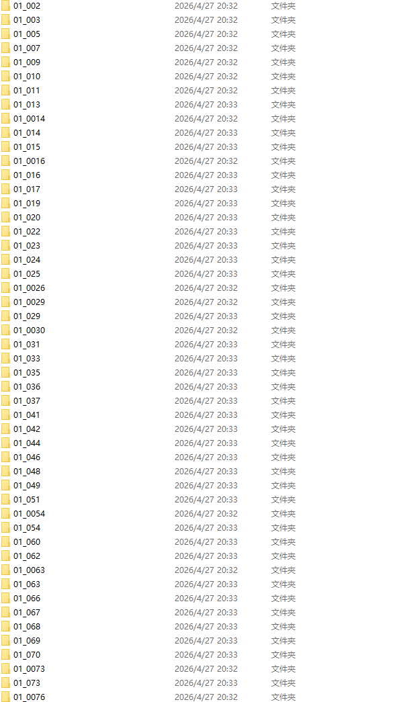
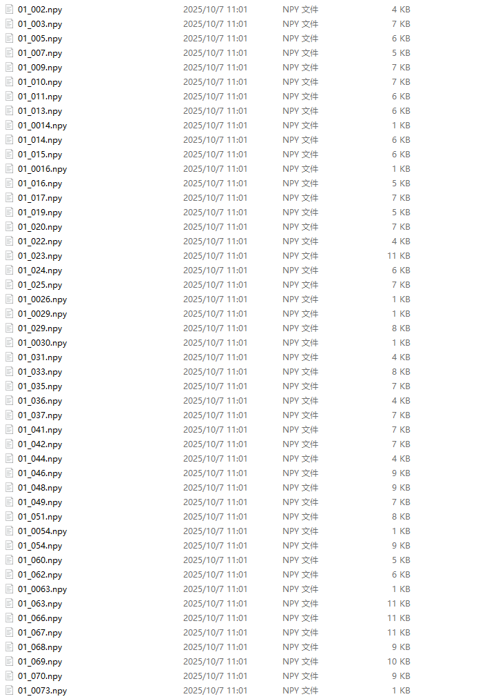
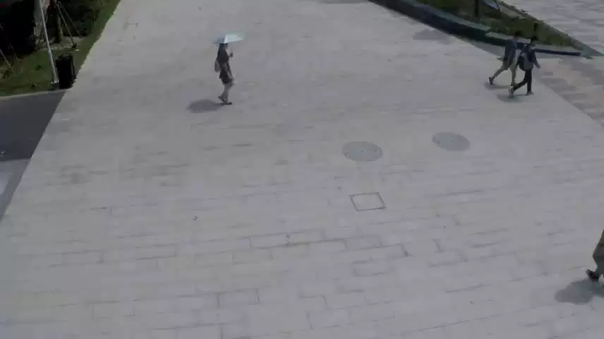
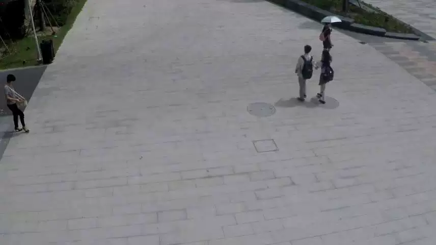

## Body

Monitoring Video Anomaly Detection Dataset: 18G

The Shanghai Science and Technology Campus dataset is specifically designed for monitoring video anomaly detection, aiming to promote generalization in diverse real-world environments. Unlike most existing datasets that only contain videos captured by a single fixed camera angle, this dataset covers multiple scenes and perspectives, making it suitable for models developed to operate under different scenarios.

The dataset includes videos from 13 different scenes within the campus of Shanghai University of Science and Technology, covering various lighting conditions, backgrounds, and camera views. It contains various types of anomalies, including those caused by sudden or abnormal movements (such as chases or brawls), which are rarely seen in other datasets.

frames/: A JPG sequence of all surveillance videos split into frames, totaling 274,515 frames, covering 13 different scenes, multiple camera views, and various lighting conditions, closely resembling a real security environment.

label/: A pixel-level annotation file (.npy format) corresponding to each video frame, marking the areas of anomalies in each frame, supporting weakly or fully supervised anomaly detection and localization tasks.

SHANGHAI_train.txt: An index file, recording the paths, start and end frames, normal / anomaly labels for each segment of video.

Number of scenes: 13
Number of anomaly events: 130
Total frames: 317,398
Training machine rack: 274,515
Test frames: 42,883
Regular frames: 300,308
Irregular frames: 17,090

Moreover, this dataset provides pixel-level annotations for anomaly regions, supporting both weakly and fully supervised anomaly detection methods.

This combination of multi-scene diversity, rich motion anomalies, and fine-grained annotations makes the Shanghai Science and Technology Campus dataset a comprehensive and realistic benchmark for research on anomaly detection.

Electronic Virtual Products Not Returnable

1. All resources sold by our store are obtained through legal and public channels such as the internet. These resources are used for reading and exchange purposes only, and their copyright belongs to the original authors or publishers. Our store does not bear any legal responsibility for copyright issues. If the original authors or publishers believe our store has infringed upon their rights, please notify us immediately to remove the content.
2. The price listed for items reflects the moderate compensation we pay for collecting, organizing, processing this material and operating our store. Sellers respect the intellectual property rights of authors and publishers and support them.
3. In case of copyright infringement complaints, this statement will serve as the basis for the complaint.

## Images

Here is a pay link on Stripe ( https://buy.stripe.com/3cs8yP7sY87d0vu9AB ). Please contact me lonlonago@foxmail.com after funding $89, and I will send you a complete data files , thank you!

